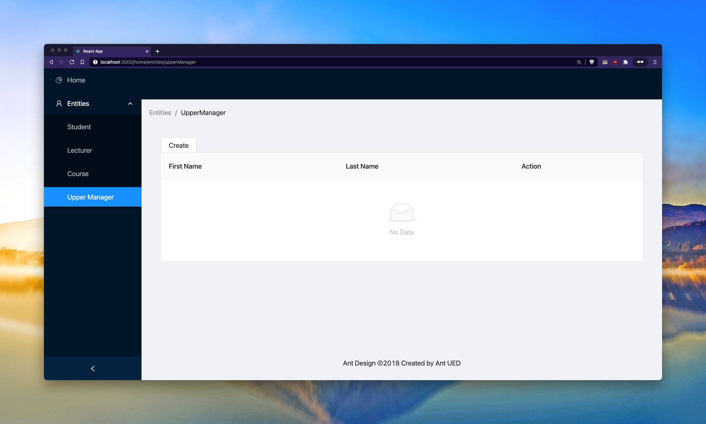

= Tutorial
:toc:
:toc-title: Nội dung
:source-highlighter: pygments

Bài viết này sẽ giới thiệu bạn đến `epsilon-clj` và cách áp dụng công cụ này vào một ứng dụng React để thêm vào một
số tính năng mới. Kết thúc bài viết này, bạn sẽ hiểu được những gì `epsilon-clj` có thể mang lại và đủ khả năng để
ứng dụng vào công việc thực tế.

== 1. Chuẩn bị

Để sử dụng `epsilon-clj`, bạn sẽ cần:

- Java 11
- NodeJS
- Một text editor bất kì

=== 1.1. Windows

Để cài Java 11, bạn có thể sử dụng https://chocolatey.org/install[Chocolatey].

Sau khi đã cài Chocolatey, mở Powershell với quyền admin và chạy lệnh sau:

[source,powershell]
----
choco install ojdkbuild11
----

Sau khi chạy xong, chạy lệnh sau để xác nhận Java đã được cài đặt:

[source,powershell]
----
java -version
----

Để cài NodeJS, xem https://nodejs.org/en/[tại đây].

=== 1.2. Linux/macOS

Để cài Java 11, bạn có thể sử dụng https://sdkman.io/install[SDKMan].

Sau khi đã cài SDKMan, mở Terminal và chạy lệnh sau:

[source,bash]
----
sdk install java 11.0.10-open
----

Sau khi chạy xong, chạy lệnh sau để xác nhận Java đã được cài đặt:

[source,bash]
----
java -version
----

Để cài NodeJS, xem https://nodejs.org/en/[tại đây].

== 2. Cài đặt `epsilon-clj`

=== 2.1. Windows

Mở Powershell và chạy câu lệnh sau:

[source,powershell]
----
cd ~

git clone https://github.com/aratare-jp/epsilon-react-demo.git

cd epsilon-react-demo
----

Tải `epsilon-v1.4.0-SNAPSHOT-standalone.jar` tại https://github.com/aratare-jp/epsilon-clj/releases[đây] và đặt vào
`~\epsilon-react-demo`.

=== 2.2. Linux/macOS

Mở Terminal và chạy câu lệnh sau:

[source,bash]
----
cd ~

git clone https://github.com/aratare-jp/epsilon-react-demo.git

cd epsilon-react-demo
----

Tải `epsilon-v1.4.0-SNAPSHOT-standalone.jar` tại https://github.com/aratare-jp/epsilon-clj/releases[đây] và đặt vào
`~/epsilon-react-demo`.

== 3. Chạy thử

IMPORTANT: Từ đây về sau, tất cả câu lệnh trong bài viết này sẽ được chạy trên Linux, nhưng trên Windows sẽ gần như
không có thay đổi.

Trước khi bắt đầu, đảm bảo rằng project của bạn trông như thế này (đừng quan tâm đến các file khác):

[source]
----
epsilon-react-demo
├── README.md
├── epsilon-v1.4.0-SNAPSHOT-standalone.jar
├── model.xml
└── templates
    └── ...
----

Mở Terminal và chạy câu lệnh sau:

[source,bash,linenums]
----
java -jar epsilon-v1.4.0-SNAPSHOT-standalone.jar -d templates -m model.xml -o university -w generate
----

Câu lệnh trên bao gồm:

- `java jar epsilon.v1.4.0-SNAPSHOT-standalone.jar`: chạy file Jar
- `-d templates`: nơi chứa tất cả template
- `-m model.xml`: model để sử dụng
- `-o university`: viết (generate) tất cả file vào `university`
- `-w`: sử dụng hot-reload để `epsilon-clj` tự generate sau khi template thay đổi
- `generate`: câu lệnh dùng để generate

IMPORTANT: Đừng lo nếu bạn không biết một số concept trên. link:#concept[Phần 4] sẽ giải thích rõ hơn.

Sau khi chạy xong, project của bạn sẽ nhìn như thế này:

[source]
----
epsilon-react-demo
├── README.md
├── epsilon-v1.4.0-SNAPSHOT-standalone.jar
├── model.xml
├── templates
│   └── ...
└── university
    └── ...
----

Chạy các lệnh sau để build và chạy app:

[source,bash,linenums]
----
cd university

npm install

npm start
----

TIP: Bạn có thể login với bất kì username hoặc password nào.

Chúc mừng! Bạn vừa tạo một app hoàn chỉnh trong vòng vài phút thay vì vài tuần!

[[concept]]
== 4. Concept

=== 4.1. Model

Hãy hình dung model là một mô hình thu nhỏ của một ý tưởng hay vật thể nào đó. Ví dụ:

- Xe đồ chơi là mô hình thu nhỏ của một chiếc xe ngoài thực tế.
- Máy bay đồ chơi là mô hình thu nhỏ của một chiếc máy bay ngoài thực tế.
- V.v.

Model được dùng để tóm tắt và mô phỏng ý tưởng hay vật thể. Ví dụ, một chiếc xe đồ chơi cũng có 4 bánh hoặc 4 cửa như
một chiếc xe thực thụ. Tại đây, chúng ta đang muốn viết một app dành cho đại học, nên model của chúng ta sẽ mô phỏng
một trường đại học ngoài thực tế.

Model trong `epsilon-clj` chỉ là một file XML đơn giản. Mở `model.xml` bằng text editor của bạn và chúng ta sẽ thấy:

.epsilon-react-demo/model.xml
[source,xml,linenums]
----
<?xml version="1.0" encoding="UTF-8" standalone="no"?>
<model>
    <entity id="student" name="Student" pluralName="Students">
        <attribute>First Name</attribute>
        <attribute>Last Name</attribute>
    </entity>
    <entity id="lecturer" name="Lecturer" pluralName="Lecturers">
        <attribute>First Name</attribute>
        <attribute>Last Name</attribute>
    </entity>
    <entity id="course" name="Course" pluralName="Courses">
        <attribute>Name</attribute>
    </entity>
    <link source="student" sourceCardinality="many" targetName="Enrolled Courses"
          target="course" targetCardinality="many" sourceName="Enrolled Students"/>
    <link source="lecturer" sourceCardinality="many" targetName="Taught Courses"
          target="course" targetCardinality="many" sourceName="Lecturers"/>
    <link source="lecturer" sourceCardinality="many" targetName="Managed Courses"
          target="course" targetCardinality="many" sourceName="Managers"/>
</model>
----

Ở đây, chúng ta có 3 entity (dịch nôm na là _thực thể_): `student` (sinh viên), `lecturer` (giảng viên), và `course`
(khoá học). Ngoài ra, chúng ta còn có 3 link (dịch nôm na là _mối liên kết_): một link từ `student` đến `course` và
hai link từ `lecturer` đến `course`.

Để dễ hình dung, đây là bản database schema cho model trên:

.Database schema
image::images/schema.png[]

Tuy nhiên, model chỉ được dùng để chứa thông tin, nhưng để _thể hiện_ thông tin (chọn thông tin nào để dùng, thông
tin nào để lược ra, v.v.) chúng ta cần phải có _template_.

NOTE: Để hiểu rõ hơn về model, chúng ta sẽ thực hành tại link:#model[phần 5.1].

=== 4.2. Template

Hình dung template giống như bản vẽ xây nhà. Với template, chúng ta có thể tạo (generate) ra nhiều vật thể giống nhau
. Lấy ví dụ trên, với bản vẽ xây nhà, chúng ta có thể xây nhiều căn nhà giống nhau.

Tuy nhiên, template chỉ bao gồm hình dáng, nhưng không có thông số. Để thêm vào thông số, chúng ta cần phải có model.
Giống như có bản vẽ xây nhà nhưng không có thông số thì chúng ta sẽ rất khó để xây được bất kì căn nhà nào!

Để tạo ra một template, chúng ta cần phải tạo một file dạng `.egl`. Bạn có thể xem sơ qua `Home.tsx.egl`:

.epsilon-react-demo/templates/src/components/Home.tsx.egl
[source,text,linenums]
----
[%	var CaseUtils = Native("org.apache.commons.text.CaseUtils"); %]
import {Layout, Menu} from 'antd';
import {PieChartOutlined, UserOutlined, BookOutlined} from '@ant-design/icons';
import React, {useState} from "react";
import {Link, Redirect, Route, Switch, useLocation, useRouteMatch} from "react-router-dom";
import Main from "./Main";
[%	for (entity in t_entity) {
        var pascalCase = CaseUtils.toCamelCase(entity.a_name, true, null); %]
import [%= pascalCase %] from "./entities/[%= pascalCase %]";
[%	} %]
----

- Tại line 1, tạo một variable mới tên `CaseUtils`.
- Tại line 7, loop qua tất cả entity trong model.
- Tại line 8, tạo một local variable tên `pascalCase` bằng tên của entity hiện tại.
- Tại line 9, tạo string bằng variable `pascalCase` vừa tạo trên.
- Tại line 10, đóng loop tại line 7.

NOTE: Để hiểu rõ hơn về template, chúng ta sẽ thực hành tại link:#template[phần 5.2].

=== 4.3. Template Controller

Bản thân template không có khả năng generate, nên chúng ta cần phải thêm _template controller_.

Template controller, như cái tên của nó, điều khiển và hướng dẫn `epsilon-clj` generate ra các file cần thiết.
Chúng ta cũng có thể xem qua `Home.tsx.egx`:

.epsilon-react-demo/templates/src/components/Home.tsx.egx
[source,text,linenums]
----
rule Home transform m : t_model {
    template: 'Home.tsx.egl'
    target: 'src/components/Home.tsx'
}
----

- Tại line 1, tạo một generate rule mới với tên `Home` cho mỗi `model` trong `model.xml`.
- Tại line 2, sử dụng `Home.tsx.egl` làm template chính.
- Tại line 3, generate file mới vào `src/components/Home.tsx`

TIP: Để ý rằng tuy rule trên loop qua tất cả `model` trong `model.xml`, nhưng chúng ta chỉ có duy nhất một `model`!
Đây là cách viết template dành cho các file độc lập, nghĩa rằng chúng ta chỉ muốn generate duy nhất một file mà thôi.

IMPORTANT: Mỗi template controller có thể chứa nhiều template, nhưng tốt nhất chỉ nên chứa một template. Nếu không,
`epsilon-clj` sẽ *_KHÔNG_* hot-reload khi template được chỉnh sửa. Ngoài ra, khi template được phát triển và mở rộng
hơn, bạn sẽ rất khó để quản lý template một cách hiệu quả.

NOTE: Để hiểu rõ hơn về template controller, chúng ta sẽ thực hành tại link:#template-controller[phần 5.3].

=== 4.4. Protected Region

Nếu bạn để ý, những gì chúng ta đã làm ở đây không khác gì những framework khác. Vậy thì `epsilon-clj` có gì đặc biệt?

Để trả lời câu hỏi trên, trước hết, để ý rằng chúng ta có workflow ra sau:

.Workflow
image::images/workflow.png[]

Template đọc thông số từ model và generate nhiều file giống nhau dựa trên các thông số đó. Nhưng đôi lúc chúng ta cần
phải thêm hoặc bớt thông tin trong những file đó. Vậy thì chúng ta nên làm vậy ở đâu?

Câu trả lời dễ nhất là *_template_*, nhưng điều đó nghĩa rằng tất cả file khác sẽ bị ảnh hưởng chung.
Và đôi lúc chúng ta không thể thay đổi template vì lý do nào đó (v.d. các project khác sẽ bị ảnh hưởng).

Câu trả lời khác là trong *_file_*, nhưng tất cả thay đổi sẽ bị xoá (generate đè) khi chúng ta generate lần sau.

Vậy thì dùng template nhưng gom tất cả thông tin riêng sang một *_template riêng_* thì sao?
Cách này cũng có phần đúng, nhưng điều này nghĩa rằng tất cả file generate bởi template đó vẫn bị ảnh hưởng.
Trừ khi bạn có thể thêm hoặc bớt template tại _run-time_, nhưng rất tiếc `epsilon-clj` không thể thực hiện điều này.

Câu trả lời đúng nhất là *_protected region_* (dịch nôm na là vùng được bảo vệ). Đây là những vùng đặc biệt trong
template nơi thông tin có thể được thêm hoặc bớt tuỳ thích, vì chúng sẽ không bị xoá khi chúng ta generate lần sau.

Protected region thường được sử dụng dưới dạng comment, do comment không gây ảnh hưởng đến code. Ví dụ,

[source,text,linenums]
----
[%= protected(out, "<!--", "Custom code here", false, "-->") %]
----

sẽ generate ra

[source,text,linenums]
----
// protected region Custom code here off begin
// protected region Custom code here end
----

Chữ `off` ám chỉ rằng protected region hiện tại "không hoạt động", nghĩa rằng tất cả code nằm giữa hai line trên sẽ
bị xoá khi generate lại từ đầu. Để kích hoạt, đơn giản đổi từ `off` sang `on`. Ví dụ, nếu chúng ta có

[source,text,linenums]
----
// protected region Custom code here on begin
console.log("Hello world!");
// protected region Custom code here end
----

thì `console.log("Hello world!");` sẽ được giữ lại ngay cả khi chúng ta generate lại tất cả.

NOTE: Để có cái nhìn rõ hơn, chúng ta sẽ thực hành tại link:#protected-region[phần 5.4].

=== 4.5. Tổng kết

Tổng kết lại những gì chúng ta đã biết:

- *_Model_*: Được dùng để mô phỏng một ý tưởng hay vật thể nào đó
- *_Template_*: Được dùng để tạo ra nhiều vật thể giống nhau
- *_Template Controller_*: Được dùng để hướng dẫn `epsilon-clj` generate file dựa trên template
- *_Protected Region_*: Vùng đặc biệt để thêm hoặc bớt thông tin

Bây giờ chúng ta sẽ thực hành sử dụng các concept trên.

== 5. Thực hành

[[model]]
=== 5.1. Model

Thêm line code sau vào giữa line 13 và 14 trong `model.xml`:

[source,xml,linenums]
----
<entity id="upper-manager" name="Upper Manager" pluralName="Upper Managers">
    <attribute>First Name</attribute>
    <attribute>Last Name</attribute>
</entity>
----

`model.xml` của bạn sẽ nhìn như sau:

.epsilon-react-demo/model.xml
[source,xml,linenums]
----
<?xml version="1.0" encoding="UTF-8" standalone="no"?>
<model>
    <entity id="student" name="Student" pluralName="Students">
        <attribute>First Name</attribute>
        <attribute>Last Name</attribute>
    </entity>
    <entity id="lecturer" name="Lecturer" pluralName="Lecturers">
        <attribute>First Name</attribute>
        <attribute>Last Name</attribute>
    </entity>
    <entity id="course" name="Course" pluralName="Courses">
        <attribute>Name</attribute>
    </entity>
    <entity id="upper-manager" name="Upper Manager" pluralName="Upper Managers">
        <attribute>First Name</attribute>
        <attribute>Last Name</attribute>
    </entity>
    <link source="student" sourceCardinality="many" targetName="Enrolled Courses"
          target="course" targetCardinality="many" sourceName="Enrolled Students"/>
    <link source="lecturer" sourceCardinality="many" targetName="Taught Courses"
          target="course" targetCardinality="many" sourceName="Lecturers"/>
    <link source="lecturer" sourceCardinality="many" targetName="Managed Courses"
          target="course" targetCardinality="many" sourceName="Managers"/>
</model>
----

`epsilon-clj` sẽ tự động nhận biết `model.xml` đã thay đổi, và sẽ generate lại tất cả template. Sau đó, React sẽ tự
động nhận biết có thay đổi trong project, và sẽ tự động reload. Trang web của bạn sẽ nhìn như sau:

.Sau khi đã add Upper Manager
image::images/after-upper-manager.png[]

Để ý sidebar bên trái đã có thêm tuỳ chọn `Upper Manager`:

.Upper Manager

Để ý table có 2 cột: `First Name` và `Last Name`, tương tự với 2 attribute nằm trong entity Upper Manager chúng ta vừa thêm vào `model.xml`.

Bạn có thể thử tạo ra một Upper Manager mới bằng cách click vào nút `Create` phía trên table:

.Form add Upper Manager

Ta có thể thấy trong form có 2 textfield, `First Name` và `Last Name`, tương tự với 2 attribute của entity `Upper
Manager` trong model.

Làm sao chúng ta lại có được 2 cột và 2 textfield như thế này? Thực tế, nếu bạn check `Student`, `Course` hay
`Lecturer`, tất cả đều khớp với model!

Câu trả lời cho câu hỏi trên là vì template, như bản vẽ xây nhà, chỉ ra hình dáng và cấu trúc của file. V.d. `_.tsx
.egl` chỉ ra hình dáng và cấu trúc của table và form trên. Sau đó chúng ta sử dụng `model.xml` để thêm vào thông số,
v.d. `Student` bao gồm 2 attribute, `Course` bao gồm 1 attribute, v.v.

Hãy thêm vào attribute `Age` cho `Upper Manager` trước khi sang phần tiếp theo.

[[template]]
=== 5.2. Template

Sau khi thêm vào attribute `Age`, bạn có thể thấy sau khi reload table có 3 cột và form có 3 textfield. Tuy nhiên,
nếu để ý kỹ hơn, tất cả textfield trong form đều là "text", nhưng "Age" là một integer. Để sửa form lại cho chính
xác, chúng ta sẽ chỉnh sửa lại template nhằm phân biệt giữa các type attribute khác nhau.

.`Age` chứa string!!!

Trước tiên, chúng ta phải chỉnh lại model để thêm thông tin về "type" của mỗi attribute. Chúng ta không muốn phải ghi
`type="string"` cho tất cả attribute, nên `string` sẽ là type mặc định cho mọi attribute và chúng ta sẽ chỉ thay đổi
type khi cần thiết. Chỉnh lại `model.xml` như sau:

.epsilon-react-demo/model.xml
[source,xml,linenums]
----
<entity id="upper-manager" name="Upper Manager" pluralName="Upper Managers">
    <attribute>First Name</attribute>
    <attribute>Last Name</attribute>
    <attribute type="integer">Age</attribute>
</entity>
----

Sau khi reload, chúng ta sẽ không thấy thay đổi trong form, do template chưa được thay đổi để sử dụng thông tin chúng
ta vừa thêm vào.

.`Age` vẫn chứa string sau khi sửa `model.xml`

Để làm
điều này, chúng ta cần phải chỉnh lại 2 file: `_.tsx.egl` và `db.ts.egl`.

.Cách đặt tên cho template
NOTE: Dấu gạch chân `\_` trong `_.tsx.egl` ám chỉ tên của entity trong model. Ở đây chúng ta có 4 file: `Student.tsx`,
`Lecturer.tsx`, `Course.tsx` và `UpperManager.tsx`. Ngoài ra chúng ta cũng sử dụng file path tương tự với file chúng
ta muốn generate. V.d. `Student.tsx` nằm trong `src/components/entities/Student.tsx` và template `\_.tsx.egl` nằm
trong `src/components/entities/_.tsx.egl`. Điều này sẽ giúp ích bạn rất nhiều khi bạn cần phải tìm template một cách
nhanh chóng.

Đầu tiên, chúng ta sẽ chỉnh lại `db.ts.egl`. Bạn có thể tìm code block sau từ line 10 đến 13 trong template:

.epsilon-react-demo/templates/src/db.ts.egl
[source,text,linenums]
----
[%	for (attr in entity.c_attribute) {
        var attrCamelCase = CaseUtils.toCamelCase(attr.text, false, null); %]
    [%= attrCamelCase %]: string,
[%	} %]
----

Trong block này, chúng ta loop qua `c_attribute`, ám chỉ tất cả attribute "children" của entity hiện tại. Sau đó,
chúng ta dùng `CaseUtils` để format lại tên của attribute. Cuối cùng, chúng ta dùng tên của attribute vừa format để
generate ra string.

Ví dụ, chúng ta có entity sau:

[source,xml,linenums]
----
<entity id="upper-manager" name="Upper Manager" pluralName="Upper Managers">
    <attribute>First Name</attribute>
    <attribute>Last Name</attribute>
    <attribute type="integer">Age</attribute>
</entity>
----

Khi chạy loop trên với model trên chúng ta sẽ có:

[source,text,linenums]
----
    firstName: string,
    lastName: string,
    age: string,
----

Để ý, type của tất cả attribute đều là `string`! Chúng ta cần phải thay đổi template để khớp với model.

Tạo một template mới tên `shared.egl` với nội dung như sau:

.epsilon-react-demo/templates/shared.egl
[source,text,linenums]
----
[%
operation t_attribute getTsType(): String {
    var type = self.a_type;
    if (type.isUndefined()) {
        return "string";
    }
    var typeMap = new Map();
    typeMap.put("string", "string");
    typeMap.put("integer", "number");
    return typeMap.get(type);
}
%]
----

Ở đây, chúng ta tạo ra một operation/function mới tên `getTsType`, có thể gọi trên `t_attribute`, và return một string.
Trong body của function, chúng ta check nếu attribute không có type chúng ta return `string`. Nếu có, chúng ta return
TS type dựa trên type của attribute đó.

Chúng ta cần phải import file này vào đầu template `db.tsx.egl`:

.epsilon-react-demo/templates/src/db.ts.egl
[source,text]
----
[% import "../shared.egl"; %]
----

Sau đó chúng ta sẽ chỉnh sửa lại line 13 của `db.ts.egl`:

.epsilon-react-demo/templates/src/db.ts.egl
[source,text]
----
[%= attrCamelCase %]: [%= attr.getTsType() %],
----

`db.ts` giữ thông tin type của mọi entity trong React app. Để sử dụng, chúng ta phải update `_.tsx.egl`. Thêm code
block sau tại cuối template `shared.egl`:

.epsilon-react-demo/templates/shared.egl
[source,text,linenums]
----
[%
operation t_attribute getInputType(): String {
    var type = self.a_type;
    if (type.isUndefined()) {
        return "text";
    }
    var typeMap = new Map();
    typeMap.put("string", "text");
    typeMap.put("integer", "number");
    return typeMap.get(type);
}
%]
----

Import `shared.egl` vào đầu `_.tsx.egl`:

.epsilon-react-demo/templates/src/components/entities/_.tsx.egl
[source,text]
----
[% import "../../../shared.egl"; %]
----

Tại line 261, thay đổi

.epsilon-react-demo/templates/src/components/entities/_.tsx.egl
[source,jsx,text]
----
<Input/>
----

thành

.epsilon-react-demo/templates/src/components/entities/_.tsx.egl sau khi đã thay đổi
[source,text]
----
<Input type="[%= attr.getInputType() %]"/>
----

Sau khi save lại, trình duyệt sẽ reload và bạn sẽ thấy form nhìn như sau:

.`Age` giờ đây chỉ chấp nhận chữ số
image::images/upper-manager-after-age.png[]

Textfield của `Age` giờ đây chỉ chấp nhận chữ số đúng như chúng ta muốn.

Để tìm hiểu rõ hơn về syntax của EGL, xem thêm https://www.eclipse.org/epsilon/doc/egl/[tại đây].

Hãy thêm attribute `Age` vào entity `Student` hoặc `Lecturer` trước khi sang phần tiếp theo.

[[template-controller]]
=== 5.3. Template controller

TIP: Để dễ dàng hơn trong việc tạo template mới, bạn nên tạo file trước khi tạo template. Việc sử dụng và test file
sẽ giúp rất nhiều khi bạn muốn copy sang template, vì template không có autocompletion hoặc linting, nên sẽ rất dễ
mắc phải những lỗi vặt không đáng có. Trong phần này, chúng ta sẽ tạo file trước và sau đó copy sang template.

Giả sử chúng ta muốn có một webpage để liệt kê và giải thích các entity trong model. Trước tiên, tạo file `Docs.tsx`
với nội dung sau:

.epsilon-react-demo/university/src/components/Docs.tsx
[source,tsx,linenums]
----
import {Breadcrumb, Layout} from 'antd';

const {Header, Content, Footer} = Layout;

export default function Docs() {
    return (
        <Layout className="site-layout">
            <Header className="site-layout-background" style={{padding: 0}}/>
            <Content style={{margin: '0 16px'}}>
                <Breadcrumb style={{margin: '16px 0'}}>
                    <Breadcrumb.Item>Docs</Breadcrumb.Item>
                </Breadcrumb>
                

                    <ul>
                        <li>Student</li>
                        <li>Course</li>
                        <li>Lecturer</li>
                        <li>Upper Manager</li>
                    </ul>
                

            </Content>
            <Footer style={{textAlign: 'center'}}>Ant Design ©2018 Created by Ant UED</Footer>
        </Layout>
    );
}
----

Thay đổi `Home.tsx.egl` để thêm vào component `Docs` mới như sau:

- Giữa line 72 và 73:

.epsilon-react-demo/templates/src/components/Home.tsx.egl
[source,jsx,linenums]
----
<Route path={`${url}/docs`}>
    <Docs/>
</Route>
----

- Giữa line 62 và 63:

.epsilon-react-demo/templates/src/components/Home.tsx.egl
[source,jsx,linenums]
----
<Menu.Item key={`${url}/docs`} icon={<BookOutlined/>}>
    <Link to={`${url}/docs`}>Docs</Link>
</Menu.Item>
----

- Tại line 11:

.epsilon-react-demo/templates/src/components/Home.tsx.egl
[source,ts,linenums]
----
import Docs from "./Docs";
----

Webpage của bạn sẽ nhìn như sau:

.Webpage Docs
image::images/docs-pre-template.png[]

Để ý tại line 14 trong `Docs.tsx`, chúng ta có `ul` bao gồm tất cả các entity trong model. Tuy nhiên, vì đây là code
viết tay, khi model thay đổi chúng ta thay đổi tại đây. Việc này rất bất tiện và khả năng cao là bạn sẽ quên. Đây là
lý do tốt nhất để biến file này thành một template.

Đầu tiên, copy và paste `Docs.tsx` vào `epsilon-react-demo/templates/src/components` với tên `Docs.tsx.egl`. Sau đó,
thay đổi từ line 14 đến 19 như sau:

.epsilon-react-demo/templates/src/components/Docs.tsx.egl
[source,text,linenums]
----
<ul>
[% for (entity in t_entity) { %]
    <li>[%= entity.a_name %]</li>
[% } %]
</ul>
----

Template không thể tự generate, mà cần phải có một template controller. Tạo một template controller tên `Home.tsx.egx`
với nội dung sau:

.epsilon-react-demo/templates/src/components/Docs.tsx.egx
[source,text,linenums]
----
rule Docs transform m : t_model {
    template: 'Docs.tsx.egl'
    target: 'src/components/Docs.tsx'
}
----

`epsilon-clj` sẽ tự động nhận biết `Docs.tsx.egx` và generate `Docs.tsx`. React sau đó sẽ reload và cuối cùng bạn sẽ có

.Webpage Docs sau khi chuyển sang template
image::images/docs-pre-template.png[]

Mặc dù nhìn không khác biệt so với khi không dùng template, nhưng khi `model.xml` được thay đổi, template
`Docs.tsx.egl` cũng sẽ thay đổi theo một cách tự động.

Để tìm hiểu rõ hơn về syntax của EGX, xem thêm https://www.eclipse.org/epsilon/doc/egx/[tại đây].

Hãy thêm một entity mới, v.d. `Room`, để kiểm tra `Docs.tsx` trước khi sang phần tiếp theo.

[[protected-region]]
=== 5.4. Protected Region

Giả sử chúng ta muốn thêm vào label cho tất cả entity nhằm dễ nhận biết hơn. Trong phần này, chúng ta sẽ sử dụng
template `_.tsx.egl`.

Trước tiên thêm vào giữa line 47 và 48 của template `_.tsx.egl` như sau:

.epsilon-react-demo/templates/src/components/entities/_.tsx.egl
[source,text]
----
<h1>[%= entity.a_name %]</h1>
----

Sau khi reload, webpage sẽ nhìn như thế này:

.Sau khi đã add header

Để ý tất cả entity đều có header này. Nhưng nếu chúng ta muốn thay đổi màu font cho chỉ `Student` thì sao? Chúng ta
cần protected region để thay đổi màu font. Tại line 32 của `Student.tsx`, đổi từ `off` sang `on`:

.epsilon-react-demo/src/components/entities/Student.tsx
[source,jsx,text]
----
// protected region Add custom rendering code for Student here on begin
----

Đổi từ `off` sang `on` nghĩa rằng bạn muốn kích hoạt protected region này. Tại line 41, thay đổi code thành:

.epsilon-react-demo/src/components/entities/Student.tsx
[source,jsx,text]
----
<h1 style={{color: "red"}}>Student</h1>
----

Webpage của bạn sẽ nhìn như thế này:

.Sau khi đã thêm code viết tay
image::images/pr-student.png[]

IMPORTANT: Để ý rằng nếu chúng ta kích hoạt protected region, tất cả nội dung bên trong sẽ được giữ nguyên. Nhưng
điều này đồng nghĩa với việc nếu bạn update template, file đó sẽ không được update! Vì thế, tốt nhất chúng ta nên giữ
protected region "nhỏ" và không bao quát tất cả code. Ở đây, bạn có thể tạo một placeholder trong render code của
`Student.tsx`, v.d. `{header}` và tạo `const header = (<h1 style={{color: "red"}}>Student</h1>);` bên trong một
protected region khác.

Để tìm hiểu rõ hơn về protected region, xem thêm https://www.eclipse.org/epsilon/doc/egl/#merge-engine[tại đây].

== 6. Tổng kết

Chúc mừng bạn đã hoàn thành buổi thực hành này. Tuy nhiên, đây chỉ nhằm giới thiệu bạn với `epsilon-clj` mà thôi. Để
sử dụng một cách hiệu quả nhất, xem thêm thông tin https://aratare-jp.github.io/epsilon-clj/[tại đây].

Tổng kết lại, bạn đã học qua cách sử dụng:

- Model
- Template
- Template controller
- Protected region